<!-- speaker notes:
...
-->

<!-- _class: first -->
<!-- _footer: '' -->

# Status Update SeaTable CS3

Christoph Dyllick-Brenzinger
March 20th, 2025, LMU München

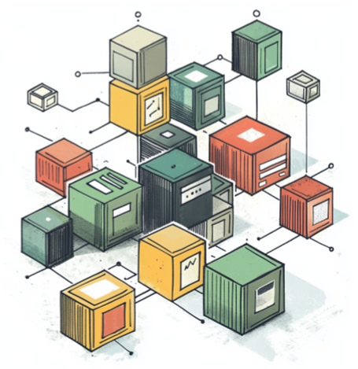

---

<!-- _class: "scoped" -->
<!-- _header: "SeaTable Status Update" -->

# What is SeaTable?

---

<!-- header: "What is SeaTable?" -->

# SeaTable in a nutshell

  

## SeaTable is the world leading self-hosted, collaborative no-code platform to build your own business processes and workflows.

― from the developers of Seafile

---

<!-- Speaker Notes
SeaTable is like Lego, standard components, multiple ways to combine them. No programming skills needed. 
... MORE! ...
-->
<!-- _header: "" -->

---

# Two software solutions - a perfect match

  

  #### Seafile 

  - **unstructured data**
  - Save / sync and share any file format
  - unlimited number of files 

  #### SeaTable

  - **structured data**
  - Build / design / work and visualize any kind of data.
  - Millions of rows

---

<!-- _class: "scoped" -->

# How does it look like?

<!-- Speaker Notes 
Screenshots of
- base editor
- visualization with plugins
- app building
-->

---

<!-- header: "" -->
<!-- This is the base editor. The visual interface to your data and also the editor for the structure of your databases. -->

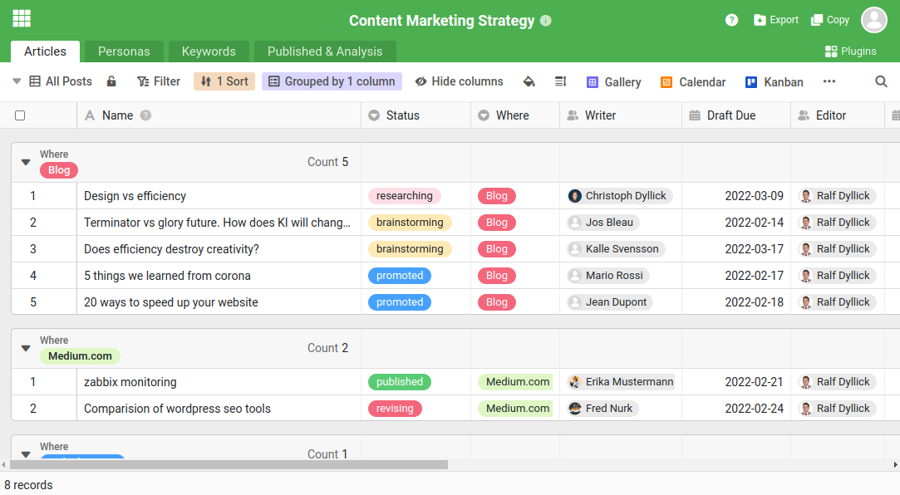

---

<!-- This is the gallery -->

---

<!-- This is the kanban board -->

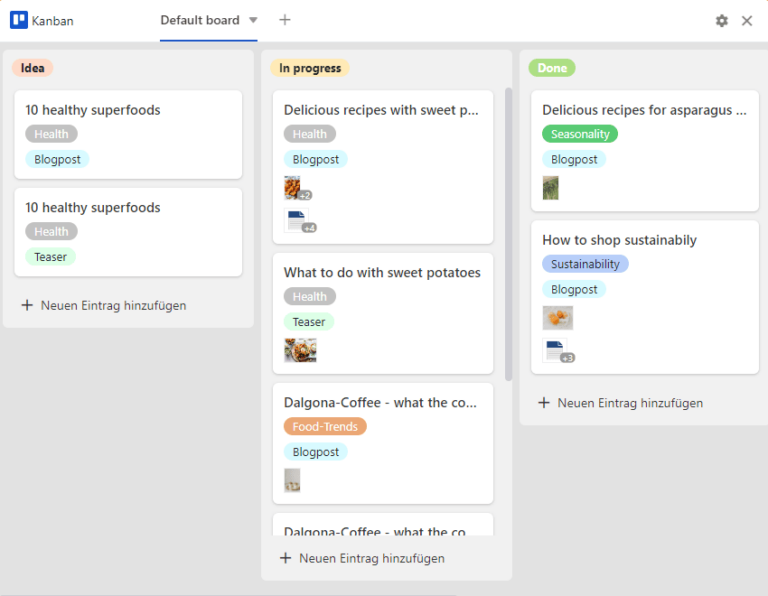

---

<!-- This is the timeline -->

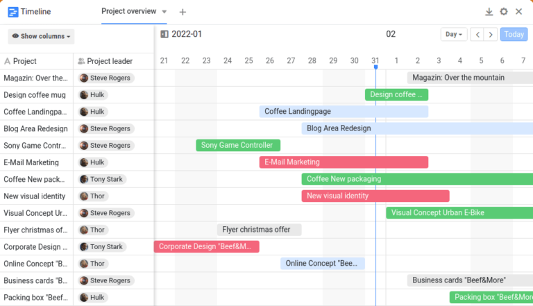

---

<!-- This is the calendar -->

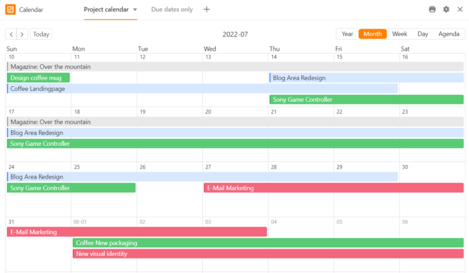

---

<!-- This is the page design plugin -->

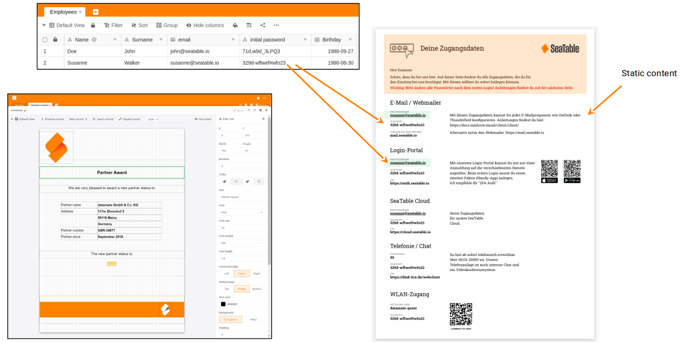

---

<!-- These are the statistics -->

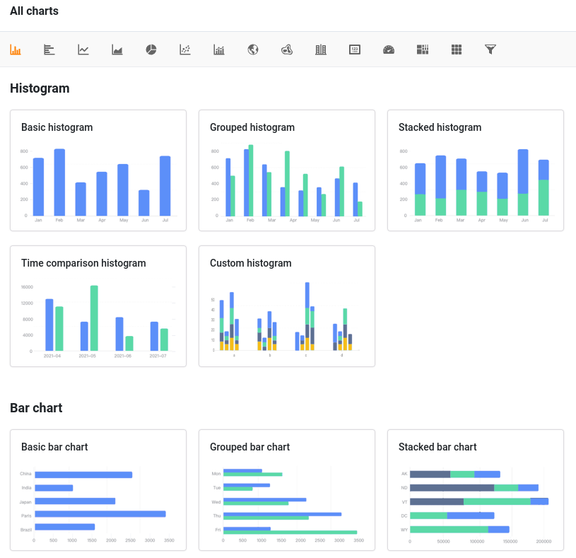

---

<!-- This is the app builder.
This one is important.  -->

---

<!-- This is the app builder.
This one is important.  -->
<!-- _header: SeaTable Status update -->

# Avaiable page types in the universal app

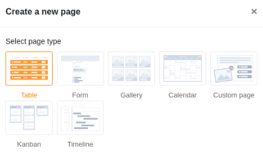

---
<!-- _header: SeaTable Status update -->

# Differences between base and app?

  #### Base

  - Designed for working directly with your data.
  - Allows editing and creating database structures.
  - Everyone with access to a base has at least read-only access to all data.
  - Primarily serves as the workspace for owners and collaborators.

  #### App

  - Provides a custom interface tailored to specific data from your base.
  - Enables fine-grained permissions for controlling access to data.
  - Displays only a subset of data relevant to the app's purpose.
  - Can be shared externally without requiring user accounts, making it suitable for customers or business partners.

---

<!-- _class: "scoped" -->
<!-- _header: "SeaTable Status Update" -->

# What happened in SeaTable in the last year?

<!-- Speaker Notes 
In a nutshell:
- last year on CS3, we had version 4.3.
- now we are on 5.2
- = one new major version, three new minor versions (4.4 -> 5.2)
-->

---

<!-- header: "What happened in the last year?" -->
# More Powerful App Builder

#### Two new page types and many many improvements in the app builder.

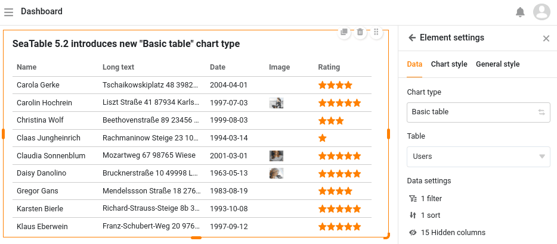

---

<cite>Four new plugins</cite>

---

<!-- Whiteboard with working collaboration: showing mouse pointers, follow other users, laser pointer ...>
<!-- header: "" -->

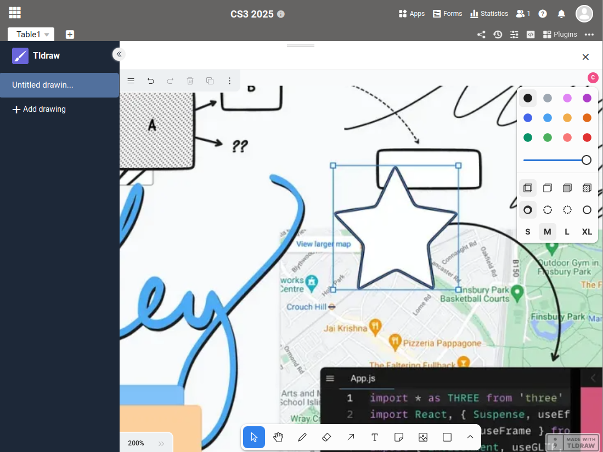

---

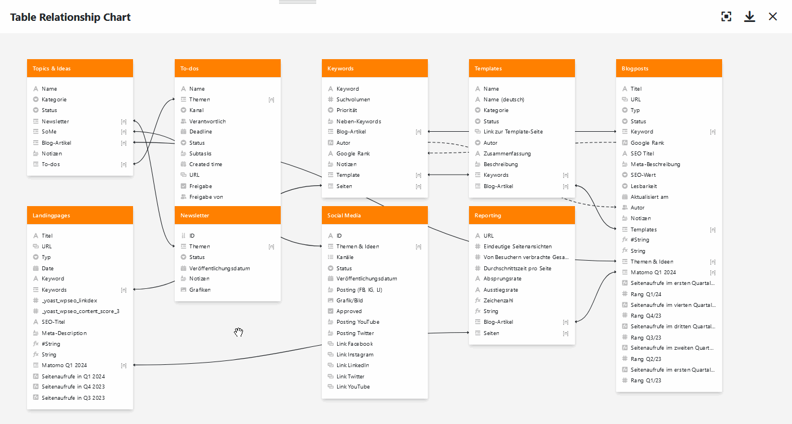

---

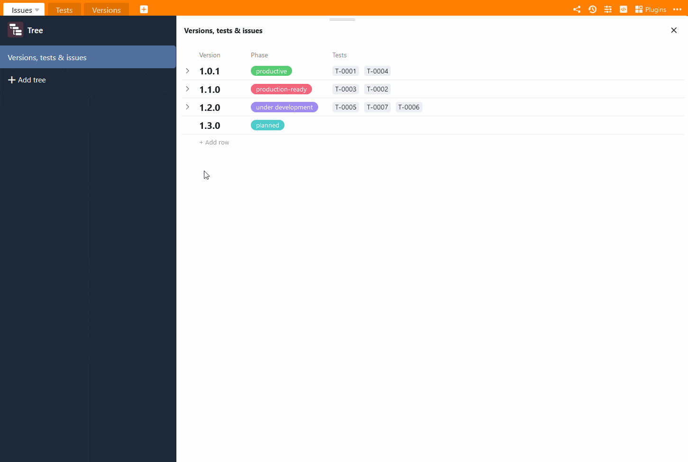

---

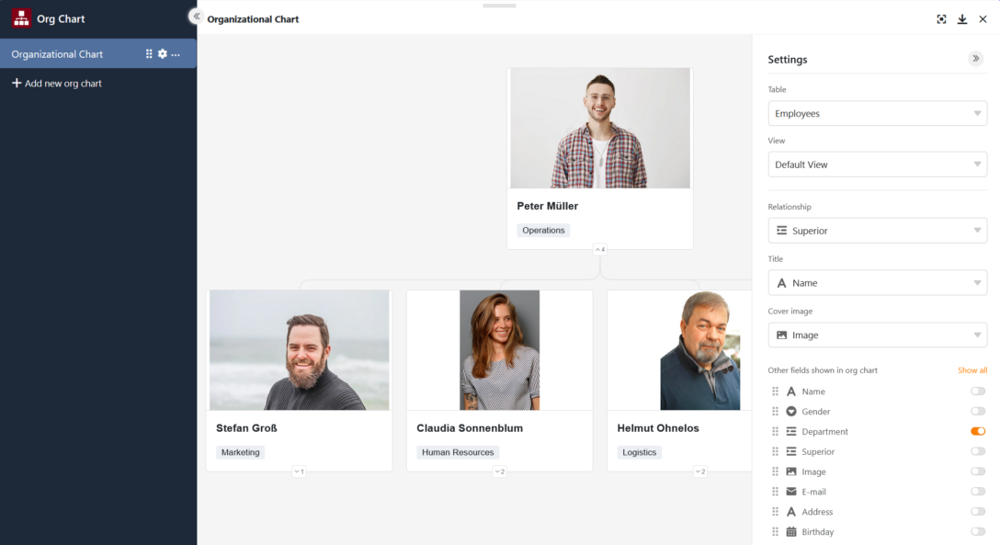

---

# Advanced filters with groups

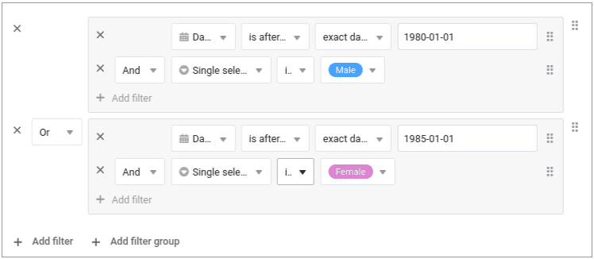

---

# OpenAPI Documentation

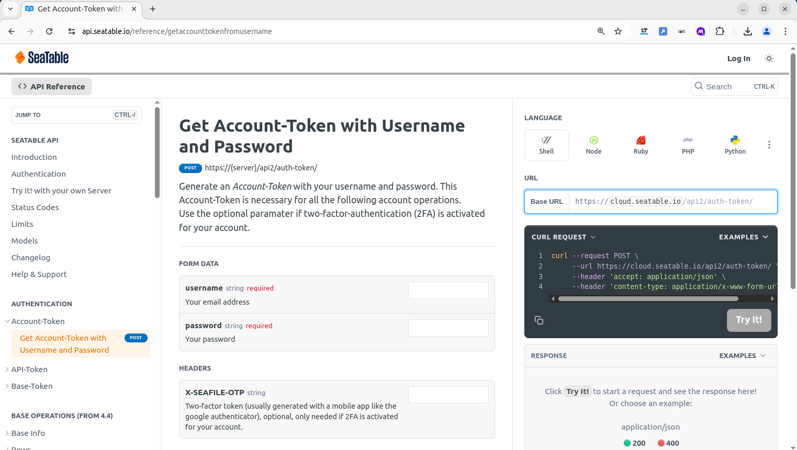

---

# Other cool stuff

- Enhanced **Import Wizard** with data preview functionality
- **Airtable Migration** Tool for seamless data transfer
- Advanced **Long-Text Editor** with improved features
- **Cross-column filters** and conditional formatting capabilities
- Harmonized API endpoints through **API Gateway** implementation
- Improved functions of SeaTable's **Big Data Backend**
- ...

---

## What else - besides new functions?

- **New Homepage Launch**: A brand-new seatable.com website was launched yesterday.
- **Pentest Success**: Independent security audit completed, revealing only minor vulnerabilities.

---

<!-- _class: "scoped" -->

# New customers (public secor)

---

# New customers

---

<!-- header: "SeaTable Status Update" -->
<!-- _class: "scoped" -->

# Outlook for CS3 2026

---

# Outlook for CS3 2026

- **AI Integration**: Chatbot and AI features
- **New Plugins**: Report Design Plugin and more
- **Advanced App Builder**: Booking pages
- **Multi-Page Web Forms**
- **Meta Apps**
- **User Impersonation**
- **BSI Certification**: Expected by end 2025
- **iOS Client**: Complementing Android app

---

<!-- speaker notes
Ladies and Gentlemen,

SeaTable ...

Thank you very much.
-->

# Interested in this presentation?

- online: https://christophdb.github.io/cs3-2025-seatable-status-update/.
- pdf: https://github.com/christophdb/cs3-2025-seatable-status-update/blob/main/Slides.pdf
